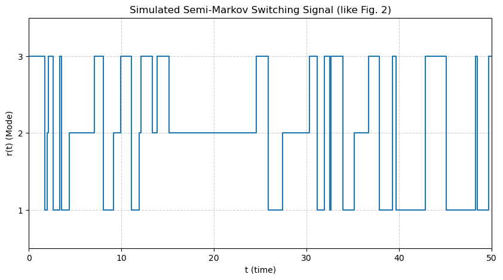
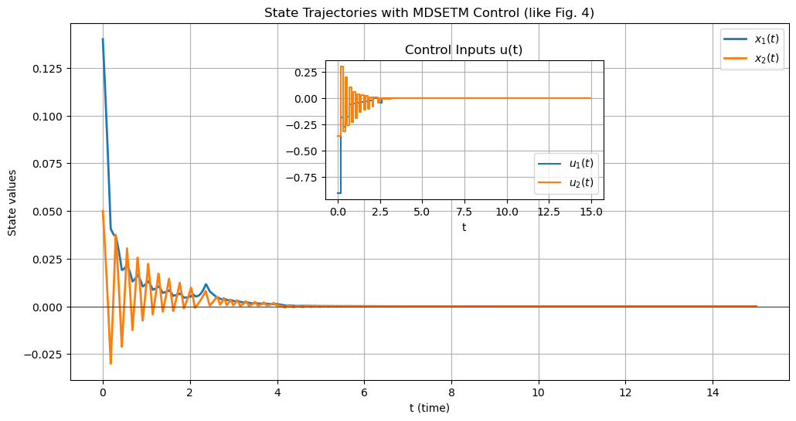
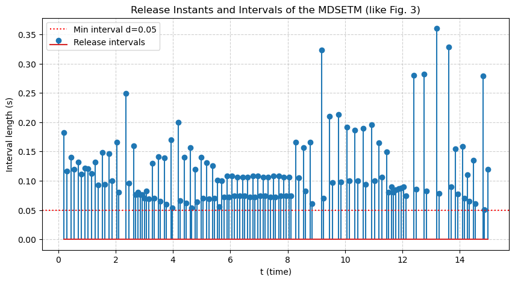

# DC 电机算例复现记录

## 1. 本节目标

本节记录论文 DC 电机算例的当前复现情况，包括已经完成的实现、保留下来的结果图，以及可继续补充的对照内容。

## 2. 已完成的工作

### 2.1 模型整理

已经整理出三模态 DC 电机模型，每个模态对应一组系统矩阵：

- $A_i$：状态矩阵；
- $B_i$：输入矩阵；
- $C_i$：扰动矩阵。

这部分参数已经进入 Python 原型脚本和 MATLAB 脚本。

### 2.2 触发逻辑实现

已经实现以下功能：

- 随机切换信号生成；
- 最小事件间隔约束；
- 模式相关事件触发矩阵；
- 状态反馈控制输入更新；
- 事件时刻、控制输入和状态轨迹记录。

### 2.3 结果出图

当前已经保留下来的结果图包括：

#### 切换信号示意

#### 状态轨迹与控制输入

#### 触发间隔

## 3. 当前结果说明

从现有结果可以确认：

1. 切换信号能够正常生成。
2. 事件触发机制能够驱动控制输入更新。
3. 状态轨迹和控制输入已经可以完整输出。
4. 触发间隔图能够反映最小间隔约束是否生效。

因此，这一算例已经具备“可运行的复现原型”。

## 4. 当前使用的脚本

- Python 原型：`scripts/python/dc_motor_mdsetm_simulation.py`
- MATLAB 分阶段脚本：`scripts/matlab/zie_pipeline/`

其中：

- Python 脚本更适合展示整体流程和出图；
- MATLAB 脚本更接近参数求解和分阶段设计流程。

## 5. 可继续补充的内容

这部分算例后续可以继续补充以下内容：

### 5.1 结果对照

- 可补充结果图与论文具体图号的一一对应；
- 可补充与论文相同参数下的关键数值汇总；
- 可整理一份正式的结果对照表。

### 5.2 结果统计

- 触发次数统计未整理；
- 平均触发间隔未整理；
- 状态峰值、收敛速度等指标未整理。

### 5.3 参数统一

- Python 原型和 MATLAB 脚本的参数来源可以进一步统一；
- 主线模型与扩展线模型使用的参数说明可以进一步分开整理。

## 6. 后续整理方向

这部分算例建议按以下顺序继续推进：

1. 补一张“论文图号 - 对应脚本 - 当前结果图”的对照表；
2. 从现有仿真结果中抽取触发次数、平均间隔、状态峰值等统计量；
3. 统一 Python 和 MATLAB 版本的参数说明；
4. 明确哪些结果属于原论文主线，哪些结果属于扩展实现。
