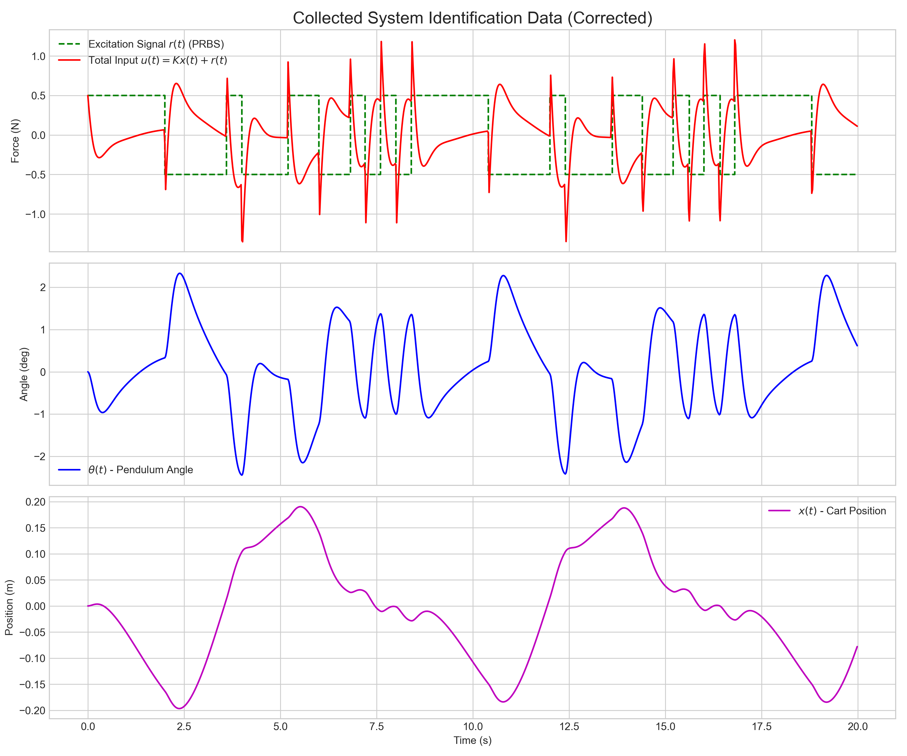
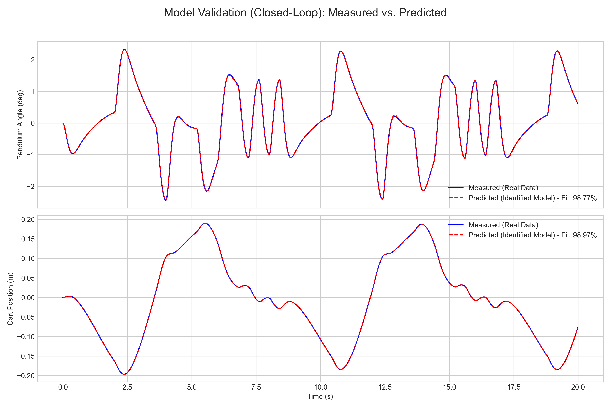

# 系统辨识与模型验证

## 1. 本节目标

本节记录倒立摆数据驱动建模路线的当前工作，包括数据采集、参数辨识和模型验证。

## 2. 数据采集

当前采用的思路是：

- 在闭环控制基础上加入 PRBS 激励信号；
- 记录系统输入与状态响应；
- 用采集到的数据进行参数估计。

当前脚本：

- `scripts/python/system_identification/collect_identification_data.py`

当前输出：

- 数据文件：`data/system_identification/identification_data.csv`
- 结果图：`assets/figures/system_identification/data_collection_plot.png`

## 3. 参数辨识

当前辨识方法采用灰盒形式的最小二乘估计，主要估计：

- $A_{23}$；
- $A_{43}$；
- $B_2$；
- $B_4$。

当前脚本：

- `scripts/python/system_identification/identify_cartpole_model.py`

当前做法是利用采样数据的数值微分构造回归问题，并将辨识结果与原始模型进行直接对比。

## 4. 模型验证

当前验证方法是：

- 使用辨识得到的模型重建闭环系统；
- 在相同激励下重新仿真；
- 将预测状态与采集数据进行对比；
- 用拟合优度衡量模型质量。

当前脚本：

- `scripts/python/system_identification/validate_identified_model.py`

当前结果图：

### 数据采集图

### 模型验证图

## 5. 当前结论

截至目前，系统辨识路线已经完成了最基本的闭环链条：

1. 设计激励信号；
2. 采集状态和输入数据；
3. 辨识关键参数；
4. 用辨识模型回放并验证拟合效果。

这说明当前项目已经具备“从数据恢复模型并进行闭环验证”的雏形。

## 6. 可继续补充的内容

- 将辨识结果整理成明确的参数对比表；
- 补充更多验证指标，例如拟合优度、均方误差；
- 进一步说明辨识模型是否足以用于再设计控制器；
- 将系统辨识路线与经典控制基线做更正式的对照。
