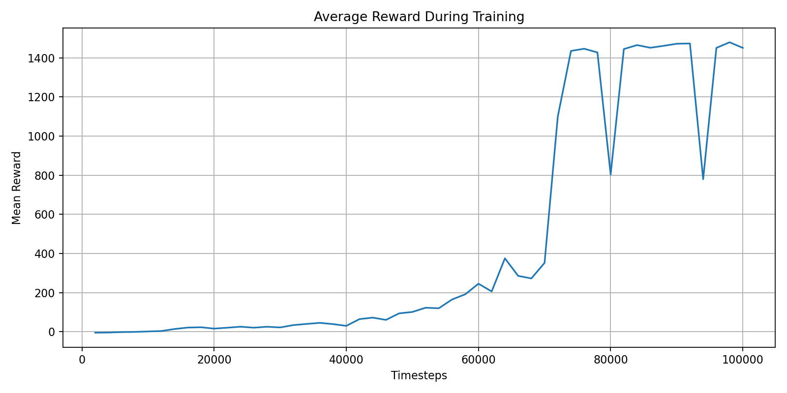
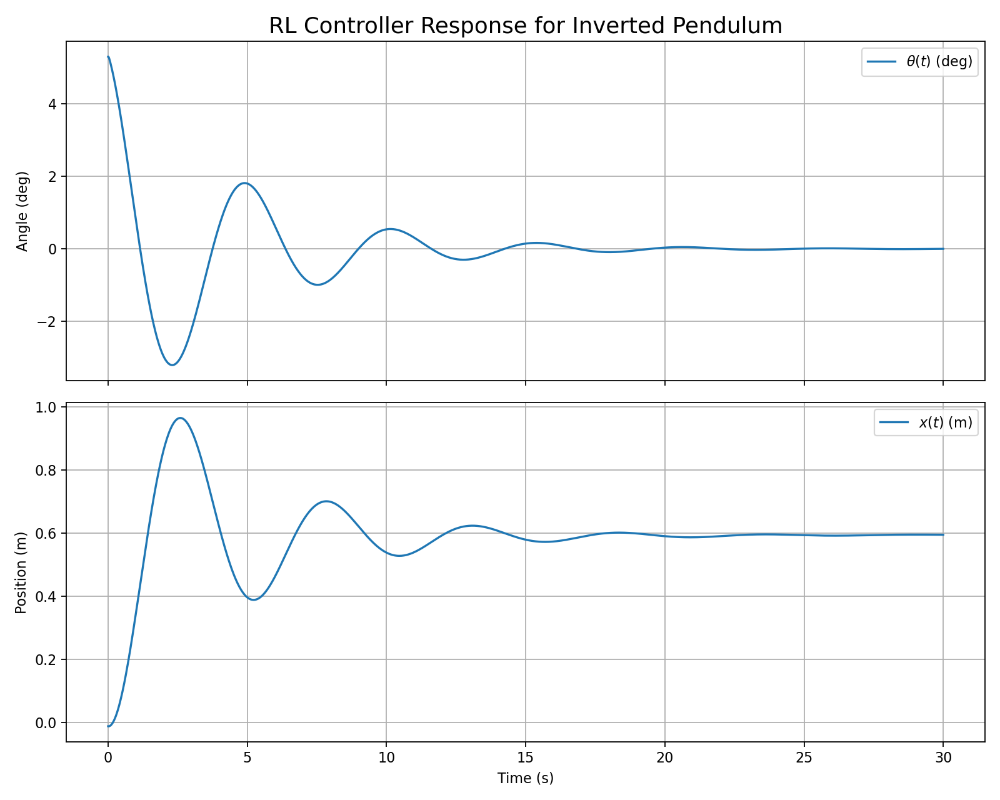

# 强化学习控制

## 1. 本节目标

本节记录倒立摆强化学习路线的当前工作，包括环境设计、训练脚本、奖励设计和现有结果。

## 2. 当前环境

强化学习部分使用的是一个自定义线性化倒立摆环境，状态定义为：

$$
[x,\dot{x},\theta,\dot{\theta}]
$$

动作定义为小车所受水平力，属于连续动作空间。

环境中的系统动力学仍然使用线性化模型：

$$
\dot{x}=Ax+Bu.
$$

因此当前强化学习研究并不是在未知环境上直接学习，而是在已知线性化模型上比较策略学习效果。

## 3. 当前脚本

### 3.1 基线训练

- `scripts/python/reinforcement_learning/train_rl_baseline.py`

作用：

- 构造基础环境；
- 使用 PPO 训练策略；
- 输出训练曲线和一次策略响应图。

### 3.2 奖励配置版本

- `scripts/python/reinforcement_learning/train_rl_profiled.py`

作用：

- 引入不同奖励配置；
- 比较不同奖励权重下的训练效果；
- 将每次训练结果输出到 `runs/reinforcement_learning/profiled/`。

### 3.3 偏差修正微调

- `scripts/python/reinforcement_learning/finetune_rl_bias_fix.py`

作用：

- 读取已有训练结果；
- 用新的奖励项继续微调；
- 重点抑制稳态位置偏差。

### 3.4 结果分析

- `scripts/python/reinforcement_learning/analyze_rl_run.py`

作用：

- 读取已有训练结果；
- 画训练曲线；
- 画策略响应图；
- 支持对多个 rollout 做平均。

## 4. 当前结果图

### 训练曲线

### 策略响应图

## 5. 当前结论

截至目前，强化学习路线已经具备以下内容：

- 环境可运行；
- PPO 训练流程已建立；
- 奖励函数已经过多轮调整；
- 已有训练曲线和响应结果可供分析；
- 已开始关注稳态偏差而不仅仅是“能否撑住”。

## 6. 进一步分析方向

- 训练结果可以进一步与经典控制基线做统一指标对照；
- 当前环境基于线性化模型，也可以继续扩展到更复杂的非线性环境；
- 奖励函数设计仍带有明显实验性质；
- 训练输出目录和最终结果汇总也可以进一步统一。

## 7. 拓展方向

- 补充 RL 与经典控制、系统辨识路线的指标对照；
- 整理不同奖励配置下的训练结果；
- 增加稳态误差、成功率、平均回合长度等统计量；
- 评估是否需要切换到更真实的非线性倒立摆环境。
