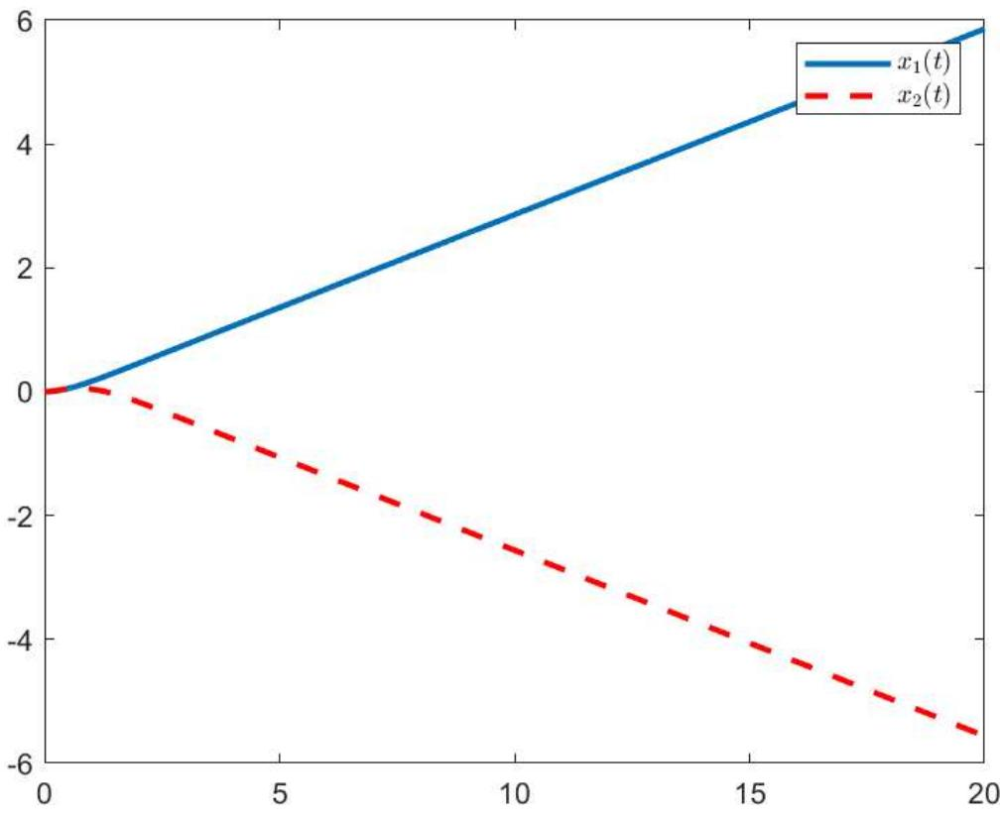
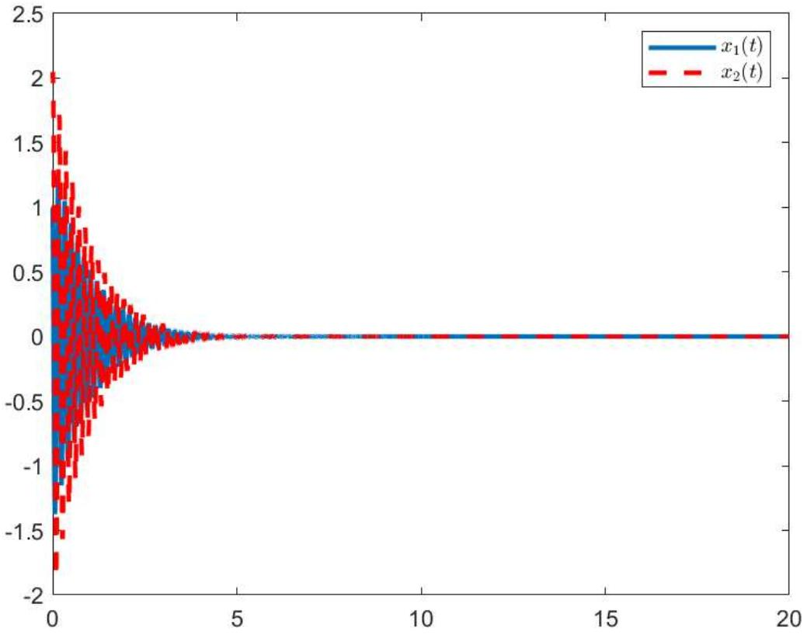
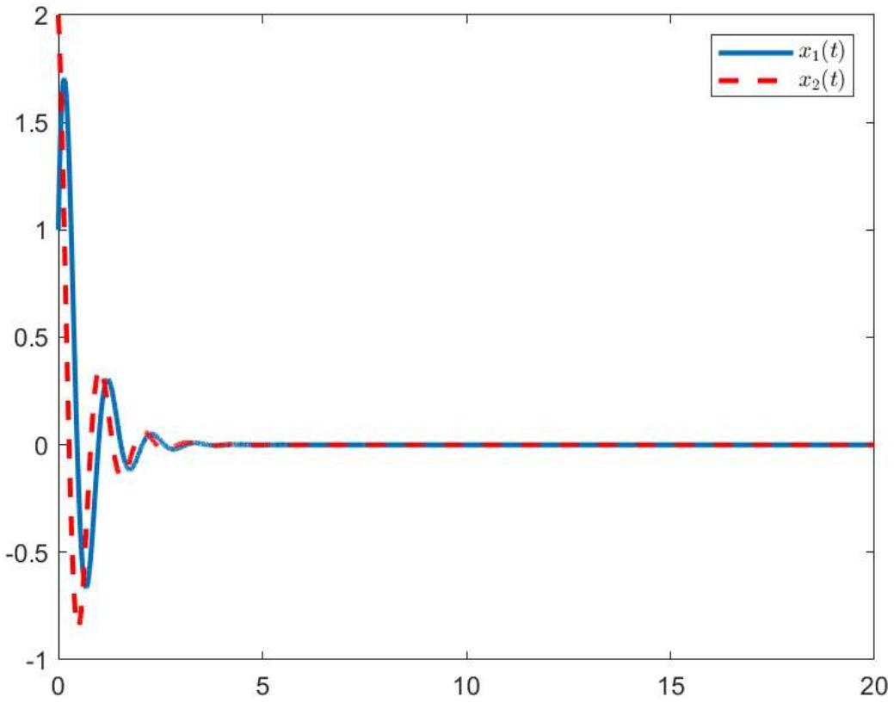
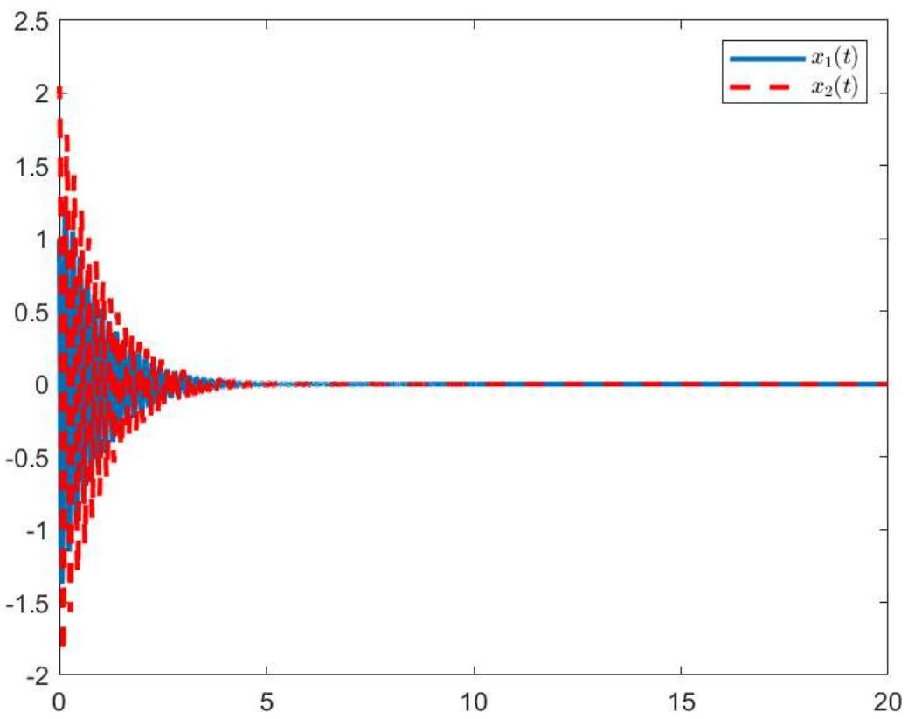
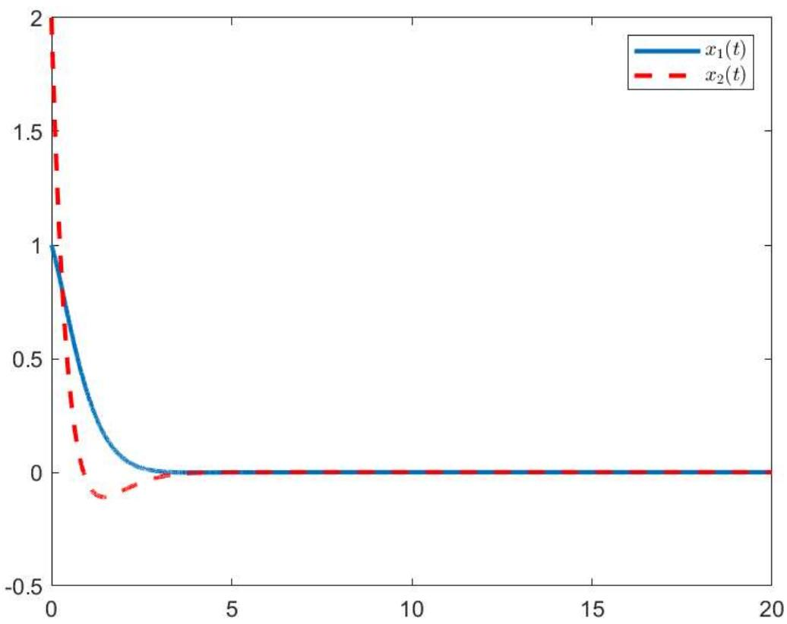
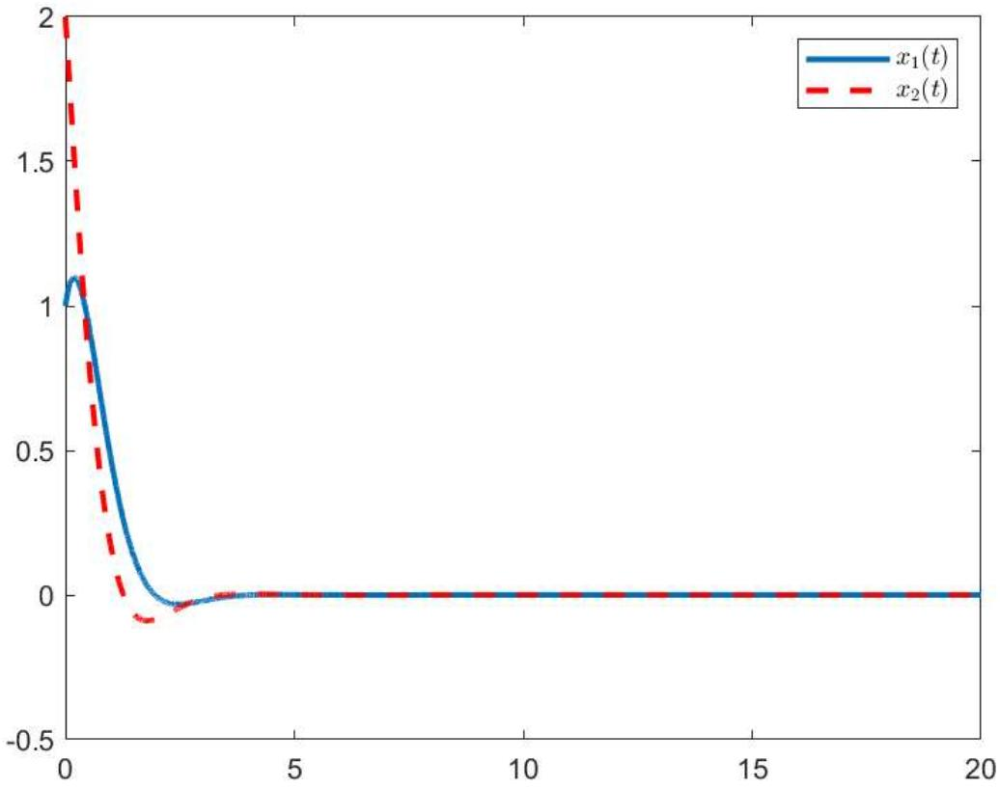

# 线性时不变系统控制笔记

## 概述

这份笔记整理了线性时不变系统的若干控制设计结论，重点包括状态反馈、输出反馈以及对应的 $H_\infty$ 性能分析与综合条件。当前内容主要保留了理论主体、核心矩阵不等式和仿真结果。

## 1. 系统模型与控制目标

考虑如下线性时不变系统：

```math
\dot x(t)=Ax(t)+Bu(t)+D\omega(t), \qquad y(t)=Cx(t),
```

其中：

- $x(t)$ 为系统状态；
- $u(t)$ 为控制输入；
- $\omega(t)$ 为外部扰动；
- $y(t)$ 为受控输出。

本文关注两类控制律：

1. 状态反馈控制：

```math
u(t)=Kx(t).
```

2. 输出反馈控制：

```math
u(t)=Ky(t)=KCx(t).
```

控制目标是在闭环系统渐近稳定的同时满足给定的 $H_\infty$ 性能指标。

## 2. 预备引理

### 2.1 引理 1：Schur 补

在后续 LMI 推导中，将频繁使用 Schur 补引理。它用于把带逆矩阵或二次项的不等式转化为标准块矩阵不等式。

### 2.2 引理 2：交叉项放缩

对于矩阵交叉项，原文采用了一类常见的松弛不等式进行处理，可概括为：

```math
\Lambda+\sum_{i=1}^N \operatorname{He}\!\left(U_iW_i^{-1}V_i^\top\right)<0
```

可由增广块矩阵形式推出等价或充分条件，以便消去非线性耦合项。

### 2.3 引理 3：变量代换思想

在控制器综合中，原问题往往含有 $PK$、$KX$ 等双线性项。常用做法是引入新变量：

```math
L=KX,\qquad Y=KX \quad \text{或} \quad L=PK,
```

将原非凸条件改写成关于 $(X,L)$ 或 $(P,L)$ 的线性矩阵不等式，最后再由

```math
K=LX^{-1}, \qquad K=P^{-1}L
```

恢复控制器增益。

## 3. 性能定义

定义闭环系统满足 $H_\infty$ 性能指标 $\gamma>0$，若在零初值条件下对任意非零扰动 $\omega(t)\in L_2[0,\infty)$，都有

```math
\int_0^\infty y^\top(t)y(t)\,dt
\le \gamma^2
\int_0^\infty \omega^\top(t)\omega(t)\,dt.
```

这等价于闭环系统从扰动 $\omega$ 到输出 $y$ 的 $L_2$ 增益小于 $\gamma$。

## 4. 状态反馈控制

### 4.1 定理 1：给定状态反馈增益的分析条件

若给定状态反馈控制器 $u(t)=Kx(t)$，则闭环系统可写为

```math
\dot x(t)=(A+BK)x(t)+D\omega(t), \qquad y(t)=Cx(t).
```

原文给出的一个标准充分条件是：若存在对称正定矩阵 $P>0$，使得某个增广矩阵不等式成立，则闭环系统渐近稳定且满足 $H_\infty$ 性能。

其核心思想是选取 Lyapunov 函数

```math
V(x)=x^\top Px,
```

并结合

```math
\dot V(x)+y^\top y-\gamma^2\omega^\top\omega<0
```

推出稳定性与性能结论。

### 4.2 定理 2：特殊情形下的综合条件

在某些特殊输入结构下，原文把综合条件化为关于 $(P,L)$ 的 LMI，并令

```math
K=P^{-1}L.
```

该结论本质上是利用变量代换把 $PBK$ 变成线性项 $BL$，从而得到可直接求解的凸优化问题。

### 4.3 定理 3：一般状态反馈综合条件

对于更一般的系统，原文给出如下常见形式的综合结果：若存在矩阵 $X>0$ 与 $L$，使得关于 $X,L$ 的 LMI 成立，则控制器增益可取为

```math
K=LX^{-1}.
```

其闭环项通常以

```math
\operatorname{He}(AX+BL)
```

的形式出现在矩阵不等式中。

这类结果是线性系统状态反馈 $H_\infty$ 设计中最常见的形式之一。

## 5. 输出反馈控制

### 5.1 定理 4：给定输出反馈增益的分析条件

对于输出反馈控制律

```math
u(t)=Ky(t)=KCx(t),
```

闭环系统矩阵变为

```math
A+BKC.
```

原文给出了对应的分析型 LMI：若存在 $P>0$ 使得相关块矩阵不等式成立，则该输出反馈控制器可以保证闭环系统稳定并满足给定性能指标。

### 5.2 定理 5：输出反馈的变量解耦

由于项 $PBKC$ 同时含有 $P$ 与 $K$，直接求解仍是非凸的。原文在可逆性或结构假设下引入辅助变量，将其写为线性形式，最终通过

```math
K=P^{-1}LC^{-1}
```

或同类关系恢复控制器。该部分更适合作为一种代换思路理解，具体适用前提仍需结合原模型维数与矩阵结构判断。

### 5.3 定理 6：基于辅助变量的综合条件

原文进一步引入 $X,Y$ 等辅助变量，将输出反馈综合转化为关于 $(P,X,Y)$ 的 LMI。求解完成后，控制器增益通常写为

```math
K=X^{-1}Y.
```

这类处理方式的目的，是把原本双线性的输出反馈综合问题转换成可由 LMI 工具箱直接求解的形式。

### 5.4 定理 7：分步设计条件

原文最后还给出了一组更复杂的分步设计条件。该方法先通过一组中间变量构造可行性判据，再由第二阶段矩阵恢复控制器参数。最终控制器通常可表示为

```math
K=R^{-1}S.
```

这说明输出反馈设计不仅可以直接做变量替换，也可以采用两阶段参数恢复的方法降低求解难度。

## 6. 仿真结果

这一部分主要展示不同控制器设计结果下的系统状态轨迹对比，便于直接观察各类设计方法的闭环效果。

### 6.1 未加控制器时的状态响应

在未施加控制器时，系统状态无法稳定收敛，轨迹表现出明显发散或持续振荡趋势。



### 6.2 定理 2 对应控制结果

采用定理 2 给出的综合方法后，系统状态逐步收敛，说明闭环稳定性得到改善。



### 6.3 定理 3 对应控制结果

状态反馈一般情形下的设计结果同样能实现收敛，图中轨迹呈现较典型的指数衰减趋势。



### 6.4 定理 5 对应控制结果

输出反馈变量解耦方法得到的控制器可稳定系统，说明在只利用输出信息的情况下也能完成闭环设计。



### 6.5 定理 6 对应控制结果

通过辅助变量构造的输出反馈控制器进一步验证了该类 LMI 设计的可行性。



### 6.6 定理 7 对应控制结果

分步设计得到的控制器同样可以使系统状态收敛，原文用该仿真说明了不同设计框架之间的可比性。



## 7. 小结

这份材料的核心脉络可以概括为：

1. 先给出线性时不变系统的标准模型与 $H_\infty$ 性能定义；
2. 使用 Schur 补和交叉项放缩引理把稳定性条件改写成 LMI；
3. 对状态反馈，采用 $L=KX$ 一类变量代换完成综合；
4. 对输出反馈，通过引入辅助变量或分步设计，缓解双线性耦合问题；
5. 最后用仿真结果验证所设计控制器的稳定效果。

## 说明

本文档保留了线性时不变系统控制中的主要模型、性能定义、状态反馈与输出反馈 LMI 设计思路，以及对应的仿真结果，适合作为这一主题的整理版学习笔记。
