# 混沌时滞神经网络同步与图像加密笔记

## 混沌系统简介

混沌系统是指一类确定性的非线性动力系统。它本身不含随机项，但由于对初值极度敏感，长期行为会表现出极强的复杂性和不可预测性。

这里的关键矛盾在于：

- 系统是确定的，未来状态完全由初值和演化方程决定。
- 系统又是难以长期预测的，因为极小的初值偏差会被不断放大。

## 混沌时滞神经网络模型

考虑如下混沌时滞神经网络：

$$
\dot {x} (t) = A x (t) + B f (x (t)) + \bar {B} g (x (t - \tau)) + J. \tag{1}
$$

其中：

- $x(t) \in \mathbb{R}^n$ 是神经元状态向量。
- $B,\bar{B}$ 是连接权矩阵。
- $J$ 是输入常量。
- $\tau$ 是时滞。
- $f(\cdot), g(\cdot)$ 是激活函数。

假设激活函数满足 Lipschitz 条件，即存在正常数 $L_f, L_g$ 使得

$$
\|f(x_1)-f(x_2)\| \le L_f \|x_1-x_2\|, \qquad
\|g(x_1)-g(x_2)\| \le L_g \|x_1-x_2\|.
$$

### 激活函数与 Lipschitz 条件说明

- 激活函数提供系统非线性，是复杂行为和混沌现象产生的根源之一。
- Lipschitz 条件限制函数变化率，保证模型“行为良好”，便于证明解的存在唯一性以及后续稳定性分析。
- 在混沌系统中，单次放大可能是温和的，但经过持续反馈和迭代后，仍会积累成显著差异。

## 驱动系统、响应系统与误差系统

将式 (1) 视为驱动系统，对应的响应系统取为

$$
\dot {\hat {x}} (t) = A \hat {x} (t) + B f (\hat {x} (t)) + \bar{B} g (\hat {x} (t - \tau)) + u(t) + J. \tag{2}
$$

定义同步误差

$$
e(t) = \hat{x}(t) - x(t),
$$

可得误差系统

$$
\dot {e} (t) = A e (t) + B \left(f (\hat {x} (t)) - f (x (t))\right) + \bar {B} \left(g (\hat {x} (t - \tau)) - g (x (t - \tau))\right) + u (t). \tag{3}
$$

### 名词说明

- 驱动系统：主系统或参考系统，自主运行。
- 响应系统：从系统或受控系统，其目标是跟踪驱动系统。
- 误差系统：用于描述同步误差随时间的演化规律。

## 控制目标与控制器

设计如下形式的状态反馈控制器

$$
u(t) = K e(t), \tag{4}
$$

使得误差系统渐近稳定，即同步误差趋于零。

### 定义：渐进同步

若

$$
\lim_{t\to\infty} e(t)=0,
$$

则称驱动系统和响应系统渐进同步。

## 关键引理

### 引理 1

对于适当维数的任意实矩阵 $X$ 和 $Y$，存在常数 $\varepsilon > 0$，使得

$$
X Y ^ {T} + Y X ^ {T} \leq \frac {1}{\varepsilon} X X ^ {T} + \varepsilon Y Y ^ {T}.
$$

这就是后续证明中使用的杨氏不等式形式。

## 定理 1

若存在矩阵 $P > 0$、$Q > 0$、$M$ 以及标量 $\varepsilon$，使得

$$
\left[
\begin{array}{c c c c}
He\{PA+M\}+Q+\frac{1}{\varepsilon}L_f^2I & 0 & PB & P\bar{B} \\
* & -Q+\frac{1}{\varepsilon}L_g^2I & 0 & 0 \\
* & * & -\varepsilon I & 0 \\
* & * & * & -\varepsilon I
\end{array}
\right] < 0,
$$

则系统 (1) 与系统 (2) 渐近同步，且控制增益可由

$$
K = P^{-1}M
$$

求得。

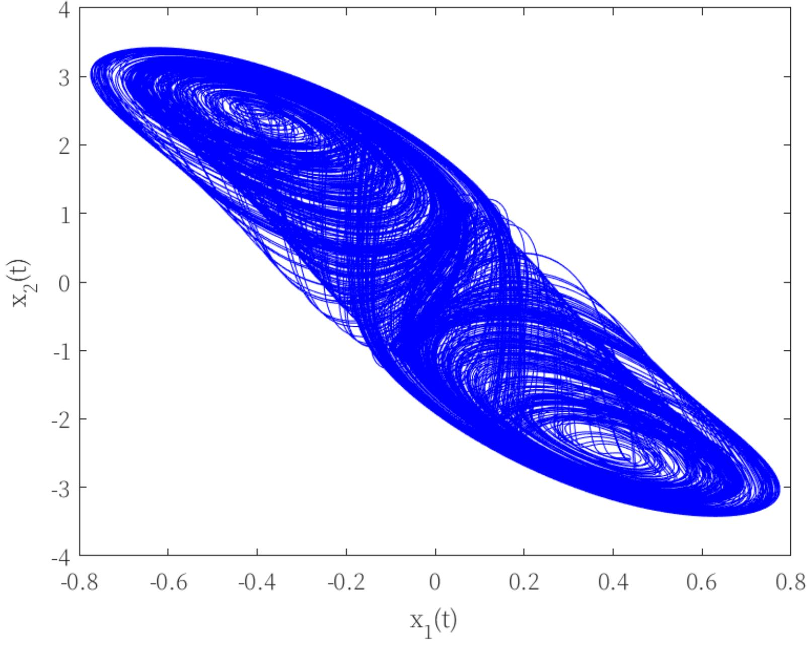

### 证明思路

构造 Lyapunov 泛函

$$
V (e (t)) = e ^ {T} (t) P e (t) + \int_ {t - \tau} ^ {t} e ^ {T} (s) Q e (s) d s.
$$

对其求导并代入误差系统，可得

$$
\dot {V} (e (t))
=
e ^ {T} (t) (He\{PA+PK\}+Q) e (t)
+ 2 e ^ {T} (t) P B \Delta f(t)
+ 2 e ^ {T} (t) P \bar{B} \Delta g(t-\tau)
- e ^ {T} (t - \tau) Q e (t - \tau),
$$

其中

$$
\Delta f(t)=f(\hat{x}(t))-f(x(t)), \qquad
\Delta g(t-\tau)=g(\hat{x}(t-\tau))-g(x(t-\tau)).
$$

再结合 Lipschitz 条件与杨氏不等式，对非线性项进行上界估计，最终得到一个关于
$e(t)$ 和 $e(t-\tau)$ 的二次型不等式。利用 Schur 补即可得到上面的 LMI 条件。

## 仿真示例

考虑如下 Hopfield 神经网络：

$$
\left[
\begin{array}{l}
\dot{x}_1(t) \\
\dot{x}_2(t)
\end{array}
\right]
=
\left[
\begin{array}{l l}
-1 & 0 \\
0 & -1
\end{array}
\right]
\left[
\begin{array}{l}
x_1(t) \\
x_2(t)
\end{array}
\right]
+
\left[
\begin{array}{l l}
2 & -0.1 \\
-5 & 2
\end{array}
\right]
\left[
\begin{array}{l}
\tanh(x_1(t)) \\
\tanh(x_2(t))
\end{array}
\right]
+
\left[
\begin{array}{l l}
-1.5 & -0.1 \\
-0.2 & -1.5
\end{array}
\right]
\left[
\begin{array}{l}
\tanh(x_1(t-1)) \\
\tanh(x_2(t-1))
\end{array}
\right].
$$

驱动系统与响应系统初值分别为

$$
\left[
\begin{array}{c}
x_1(s) \\
x_2(s)
\end{array}
\right]
=
\left[
\begin{array}{c}
1.7 \\
2.5
\end{array}
\right],
\qquad
\left[
\begin{array}{c}
\hat{x}_1(s) \\
\hat{x}_2(s)
\end{array}
\right]
=
\left[
\begin{array}{c}
1 \\
2
\end{array}
\right],
\qquad
s\in[-1,0].
$$

求得控制增益

$$
K =
\left[
\begin{array}{c c}
32.8175 & 47.7361 \\
-133.1490 & -79.0097
\end{array}
\right].
$$

### 仿真结果

驱动系统的相平面轨迹如下：

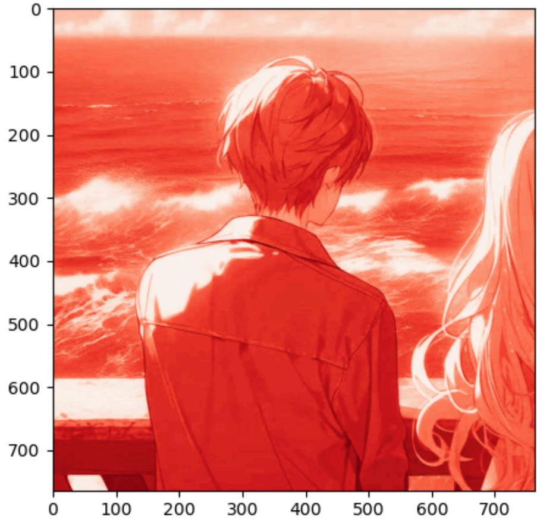

误差系统的状态轨迹如下：

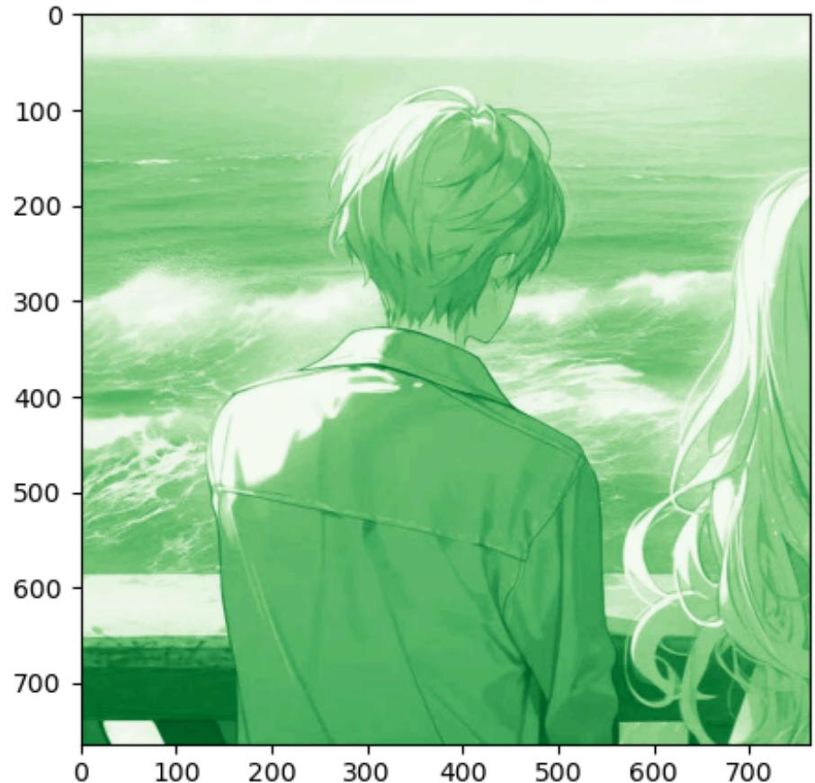

## 图像加密应用

文档后半部分给出了一个基于混沌系统的图像加密示例。其核心思路是利用混沌轨道生成密钥流，对图像像素进行置乱或扩散，从而破坏原始图像的统计特征。

### 原始图像与 RGB 通道

原图：

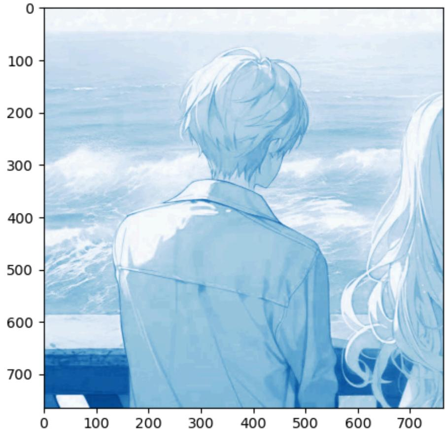

红色通道：

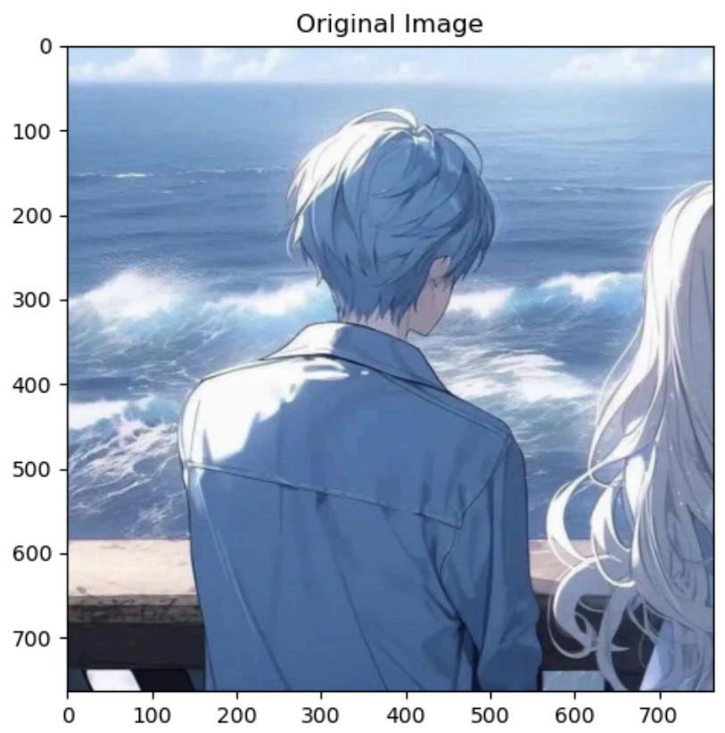

绿色通道：

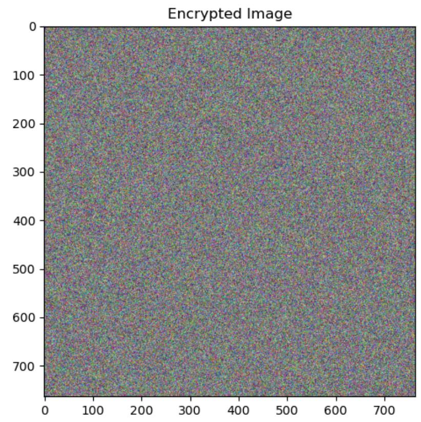

蓝色通道：

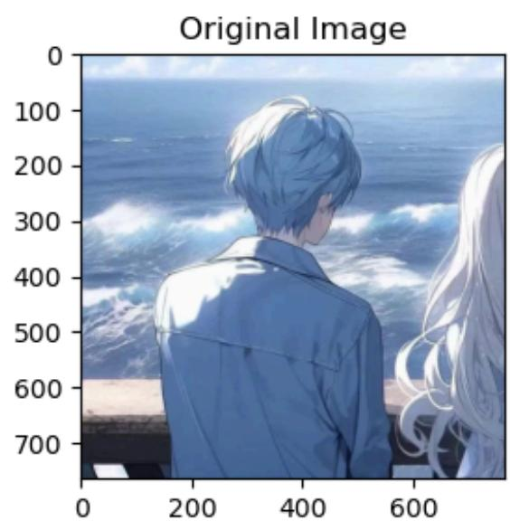

### 加密与解密结果

加密后的图像结果如下：

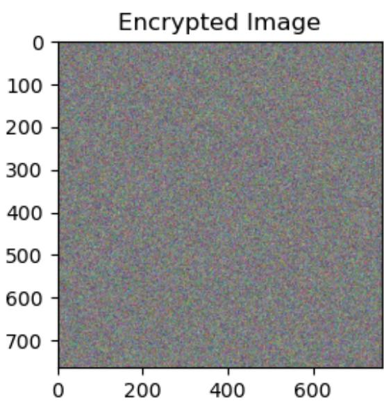

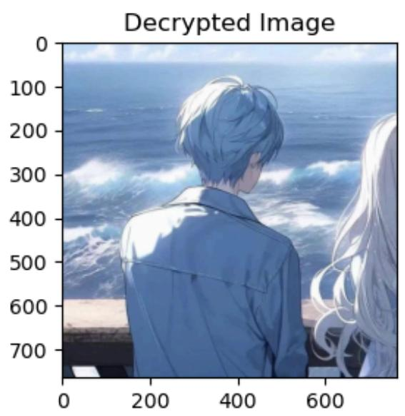

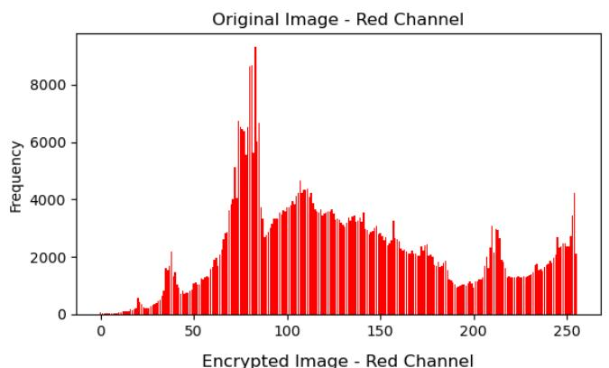

解密后的图像结果如下：

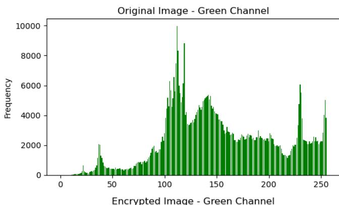

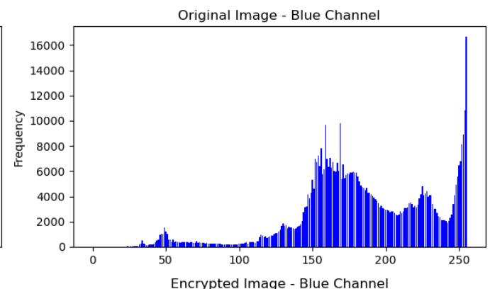

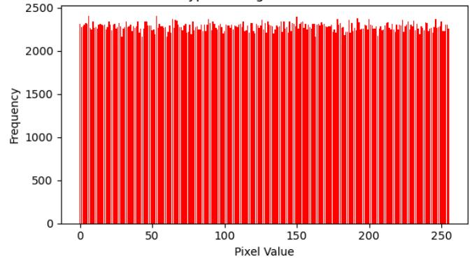

### 灰度直方图分析

原图与加密图的灰度直方图如下：

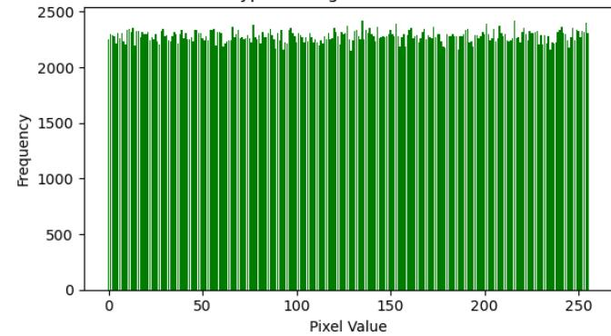

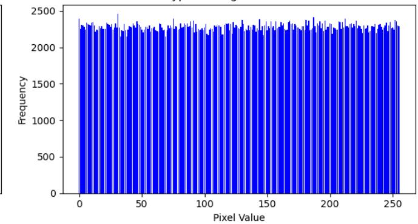

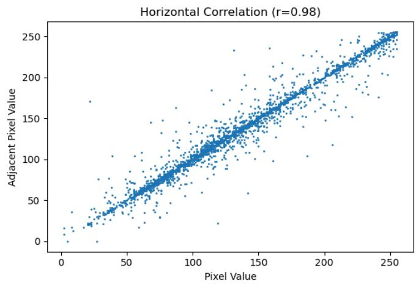

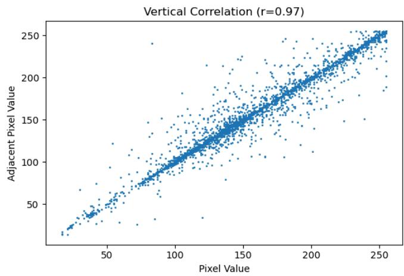

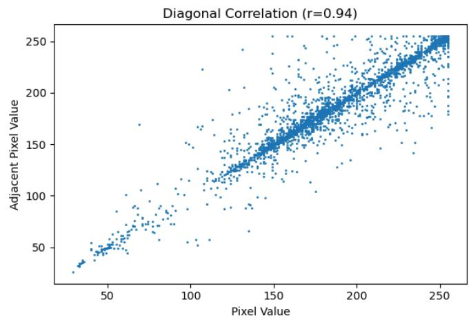

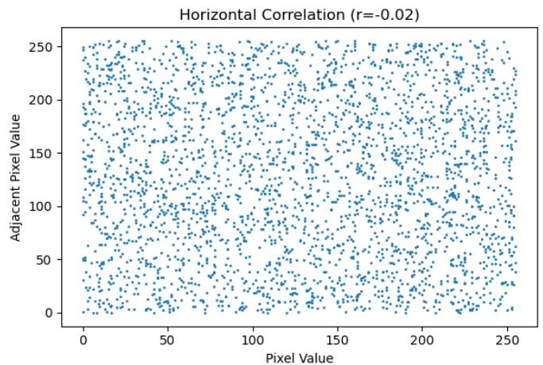

### 相关性分析

原图相关性分析：

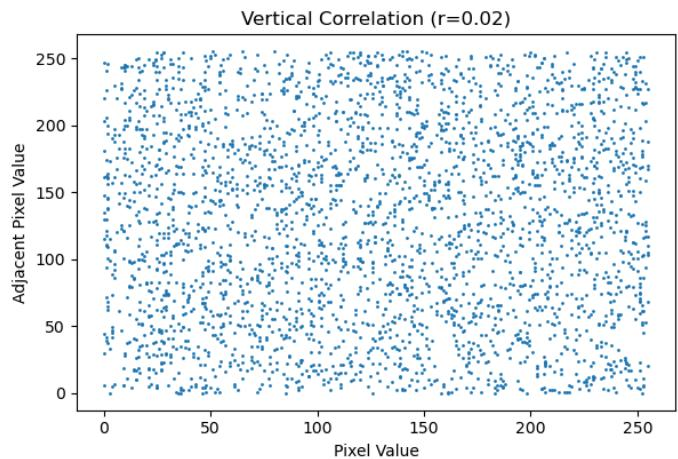

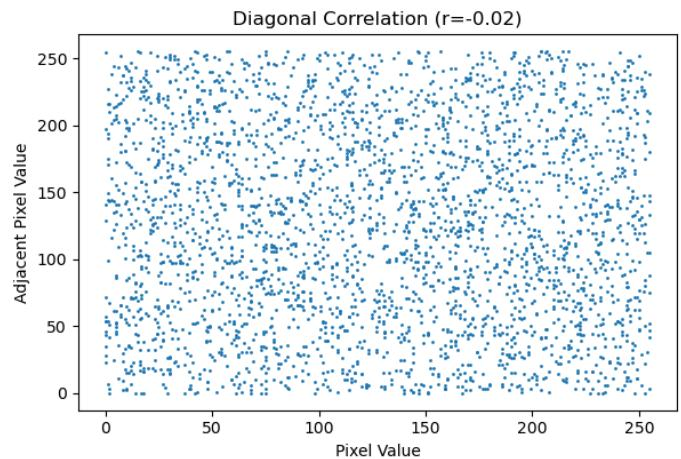

### 小结

从图像结果可以看出，加密后的图像已经失去明显的统计结构，说明混沌加密在像素分布打散方面是有效的。

## 附注

原始 Markdown 后半部分包含一批 OCR 损坏较严重的 MATLAB / Python 代码片段。由于符号、括号和运算符存在大量识别错误，这里没有原样保留，而是保留了理论结构、主要公式、仿真结果和图像加密结果。若你需要，我下一步可以继续单独把那部分代码整理成可运行版本。
