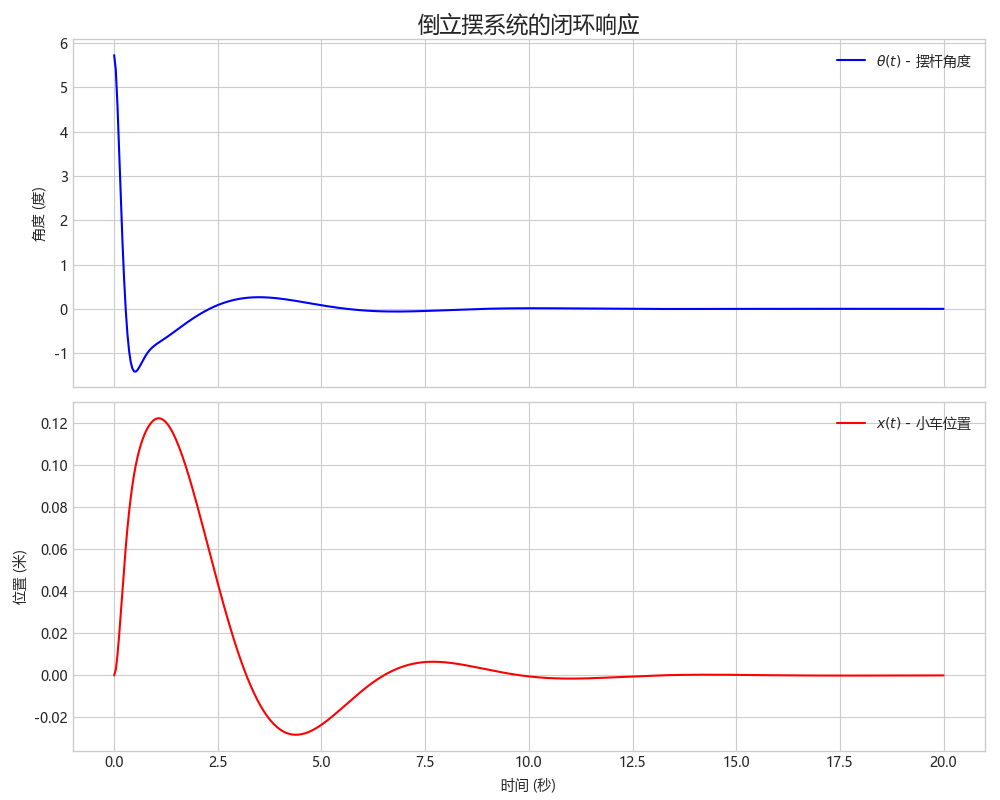

# 经典控制基线

## 1. 本节目标

本节记录倒立摆经典控制路线的当前结果，包括模型、控制器、仿真结果和现阶段结论。

## 2. 线性模型

当前采用的线性状态空间模型为

$$
\dot{x}(t)=Ax(t)+Bu(t),
$$

状态定义为

$$
x(t)=\begin{bmatrix}x & \dot{x} & \theta & \dot{\theta}\end{bmatrix}^T.
$$

在给定参数下，当前整理出的系统矩阵为

$$
A=
\begin{bmatrix}
0 & 1 & 0 & 0 \\
0 & 0 & -0.7171 & 0 \\
0 & 0 & 0 & 1 \\
0 & 0 & 31.5512 & 0
\end{bmatrix},
\qquad
B=
\begin{bmatrix}
0 \\
0.9756 \\
0 \\
-2.9268
\end{bmatrix}.
$$

## 3. 控制器设计

当前控制律采用状态反馈形式

$$
u(t)=-Kx(t).
$$

已有材料中通过 LMI 方法求得一组反馈增益

$$
K=\begin{bmatrix}2.7021 & 2.6267 & 39.6988 & 5.1432\end{bmatrix}.
$$

这组增益已经进入 Python 与 MATLAB 脚本中用于闭环仿真。

## 4. 已完成实现

### 4.1 Python 实现

脚本：

- `scripts/python/classical_control/simulate_cartpole_lqr.py`

已完成内容：

- 定义线性闭环模型；
- 计算闭环响应；
- 绘制摆角与小车位置响应图；
- 结果图保存到 `assets/figures/classical_control/`。

### 4.2 MATLAB 实现

脚本：

- `scripts/matlab/classical_control/sol1.m`
- `scripts/matlab/classical_control/pendulum_sim.m`
- `scripts/matlab/classical_control/cartpole_lin_closedloop.m`
- `scripts/matlab/classical_control/animate_cartpole.m`

已完成内容：

- LMI 求解；
- 闭环仿真；
- 动画与辅助脚本保留。

## 5. 当前结果图

### 闭环响应图

## 6. 当前结论

当前经典控制路线已经形成一个可用基线：

- 模型明确；
- 控制器已求得；
- 闭环仿真可运行；
- 可以作为后续系统辨识和强化学习路线的对照对象。

## 7. 待完成事项

- 明确 LMI 设计过程与标准 LQR 的关系；
- 补充闭环极点、稳定时间、控制能量等指标；
- 统一 MATLAB 与 Python 版本的结果说明。
